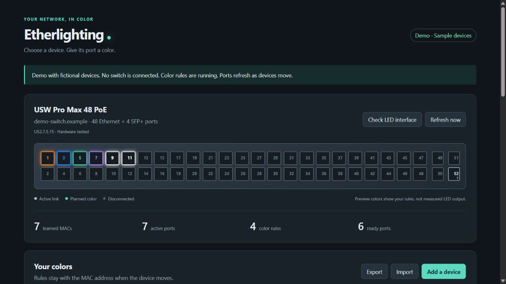
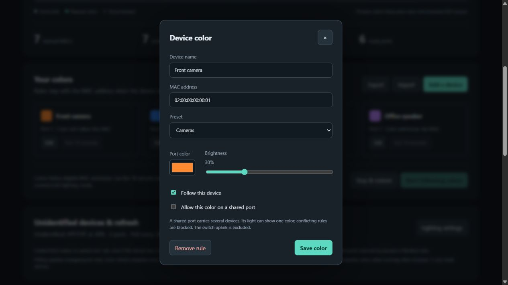
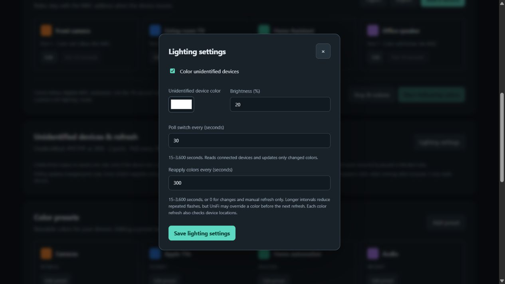

# Etherlighting for Home Assistant

Give a device a color, and let its UniFi switch port follow it.

A local Home Assistant app for discovering connected MAC addresses and controlling port colors on compatible **UniFi Pro Max switches**. Includes editable presets, per-device brightness, fallback colors, and adjustable refresh intervals.

**Experimental community project; not an official Ubiquiti product.** Pro Max 48 PoE on `US2.7.5.15` has been tested on hardware. Other listed models have experimental software support and require physical testing. This is a sidebar app, not a HACS integration or native Home Assistant light entities.

## Screenshots

The actual app running with fictional devices through the included demo. No private network details are shown. The port map previews planned colors, not measured LED output.



<details>
<summary>Device color editor</summary>



</details>

<details>
<summary>Unidentified devices and refresh settings</summary>



</details>

## Features

- Discover devices and search by name, MAC, IP, or `port:12`.
- Follow a device's port when it moves, using saved color and brightness rules.
- Add, rename, recolor, and delete presets. These are shortcuts; changing one leaves existing device colors unchanged.
- Give devices without a saved rule a fallback color, including devices with known names.
- Poll for changes without rewriting unchanged colors. Reapply all colors on a separate timer or with **Refresh now**.
- Preview the detected switch layout, test one port for ten seconds, and restore stock lighting when stopping.
- Persist rules, presets, and settings; import/export device rules as JSON.
- Exclude uplinks, stale entries, ambiguous MAC locations, and conflicting shared-port assignments.

## Compatibility

| Model | Ethernet + SFP+ ports | Status |
|---|---:|---|
| USW-Pro-Max-48-PoE | 48 + 4 | Hardware tested on `US2.7.5.15`; other firmware experimental |
| USW-Pro-Max-48 | 48 + 4 | Experimental |
| USW-Pro-Max-24-PoE | 24 + 2 | Experimental |
| USW-Pro-Max-24 | 24 + 2 | Experimental |
| USW-Pro-Max-16-PoE | 16 + 2 | Experimental |
| USW-Pro-Max-16 | 16 + 2 | Experimental |
| Pro XG, Pro HD, Enterprise, other families | — | Not supported by this driver |

Profiles use published port counts; their presence is not a claim of hardware testing. Before LED control, the app checks identity, the RGBW interface, advertised port range, and stock lighting mode. Experimental combinations require **Allow experimental models** in configuration. Passing checks cannot prove physical color accuracy or restoration: observe a ten-second test first.

Other Etherlighting families may use different protocols. See [compatibility evidence and limitations](COMPATIBILITY.md). One switch is controlled per app installation.

## Install in Home Assistant

### Requirements

- Home Assistant OS with Apps support, on `amd64` or `aarch64`.
- A listed switch with device SSH enabled, reachable from Home Assistant on TCP port 22.
- Its device SSH username/password and independently verified SSH public host key. Your UniFi cloud login is not automatically the switch SSH login.

### Add the repository

1. Open **Settings → Apps → Install app**. Older releases may call these **Add-ons** and **Add-on Store**.
2. Open the store menu, select **Repositories**, and add:

   ```text
   https://github.com/chanson6680/etherlighting
   ```

3. Refresh the store, open **Etherlighting**, and click **Install**. The image builds on your Home Assistant host; the first build can take several minutes.
4. Open **Configuration**, complete the connection fields below, and leave LED control off initially.
5. Save, start the app, enable **Show in sidebar**, and select **Open Web UI**.

The app uses Home Assistant ingress, with no separate web port to expose. It does not require privileged mode, host networking, or Supervisor API access. See [Home Assistant's app guide](https://www.home-assistant.io/addons/).

### Configure SSH

Enable **Device SSH Authentication** in UniFi Network. Current versions expose it under **UniFi Devices → Device Updates and Settings → Device SSH Settings**. See [Ubiquiti's SSH instructions](https://help.ui.com/hc/en-us/articles/204909374-Connecting-to-UniFi-with-Debug-Tools-SSH) for version-specific navigation. This is the switch's SSH service, not the UniFi console's SSH setting.

| App option | What to enter |
|---|---|
| Switch address | Switch IP address or hostname |
| Device SSH username | Existing device SSH username |
| Device SSH password | Existing device SSH password |
| Verified SSH public host key | Key type followed by the complete base64 public key, such as `ssh-ed25519 …` |
| Initial polling interval | Initial device poll interval; default 30 seconds |
| Allow LED control | Leave off until ready to observe a physical test |
| Allow experimental models | Required for listed models/firmware outside the hardware-tested combination |

Use a public host key from an independently verified SSH connection. A normal OpenSSH `known_hosts` entry has a host field, key type, and base64 key: copy **the key type and key only**, without the host field. A `SHA256:…` fingerprint is not the full key. Never enter a private key. Changed or unknown host keys are rejected.

Passwords stay in Home Assistant app configuration and are not sent to the browser interface. Connection defaults in this repository are empty. No UniFi API key is required.

## First run

1. Check the detected model, firmware, port count, and discovered devices.
2. Choose a device on a non-uplink port with one learned MAC. Select its color, brightness, and optional preset; click **Save color**.
3. Enable **Allow LED control** in app configuration and restart. For experimental profiles, also enable **Allow experimental models** after reviewing compatibility.
4. Click **Check LED interface**, then **Test 10 seconds** on the rule. Watch for the chosen color and its return to stock lighting. Continuous control must be stopped for tests.
5. If both work, click **Start following colors**. **Stop & restore** returns the switch to its current stock lighting mode.

Restarts intentionally leave color control paused, even with Home Assistant's **Start on boot** enabled. Open the app and start following colors again when ready.

### Shared ports and unidentified devices

A port can carry many MACs behind an access point or another switch, but show only one color. Such a device rule requires **Allow this color on a shared port**. Conflicting colors are blocked.

In **Lighting settings**, enable **Color unidentified devices** and select color/brightness. “Unidentified” means no saved rule, even when the device has a name. This covers eligible shared ports too. Saved rules take priority; uplinks and ports reserved by paused or blocked rules are excluded. Ports without recently learned devices are not colored. The initial fallback selection is white at 20%, disabled until saved.

### Refresh and flashing

| Control | Default | Behavior |
|---|---:|---|
| Poll switch every | 30 seconds | Discover devices and write changed colors only; range 15–3,600 seconds |
| Reapply colors every | 300 seconds | Recheck locations and write every planned color; range 15–3,600 seconds, or 0 to disable repeated writes |
| Refresh now | Manual | Read devices and reapply all colors while running; read devices only while stopped |

UniFi can overwrite a color between refreshes. Shorter reapplication intervals correct this sooner; longer intervals reduce flashing. Set reapplication to **0** for changes and manual refresh only. Saving lighting settings applies changes while running. In-app settings override the initial polling interval in Configuration.

The driver writes separate LED channels, so forced updates can briefly flash. Removing a previously colored port from the plan restores the stock mode globally before reapplying the remaining colors; this can also flash other ports.

## Updates, backups, and recovery

- Use the normal Home Assistant app update flow. Back up first, then resume color control after the restart.
- App backups include rules, presets, and lighting settings. **Export** includes only device rules. **Import** merges by MAC, replacing matching entries.
- Changing repository URLs can create a separate app installation with separate storage. Export rules and record presets/settings before migration. Stop the old controller before starting the new one.
- If restoration is pending, reconnect and press **Stop & restore**. A crash or network outage can prevent immediate physical restoration.
- UniFi lighting changes can replace app colors. Do not run two LED controllers against the same switch.

| Problem | What to check |
|---|---|
| App not listed | Repository URL, store refresh, and Apps support |
| Cannot connect | Device SSH credentials, switch address, TCP 22 access, and public host key |
| Host key changed | Independently verify switch identity before replacing the saved key |
| Experimental model blocked | Compatibility table, experimental option, then physical test; unknown families remain blocked |
| Port table or RGBW interface rejected | Firmware may differ; report sanitized diagnostics instead of bypassing checks |
| Rule does not apply | Active link, MAC age ≤300 seconds, shared-port permission, conflicts, or uplink exclusion |
| Colors look wrong | Try lower brightness and a ten-second test; LED and cable appearance varies |
| Colors stop after restart | Continuous control starts paused; press Start following colors |

## Development and demo

The Home Assistant image uses Python 3.12. From the repository root:

```sh
python -m pip install -r etherlighting/requirements.txt
python -m unittest discover -s tests -v
node --check etherlighting/web/app.js
python tools/demo.py
```

Open `http://127.0.0.1:8099/` for the actual UI with fictional devices. The demo never connects to a switch, and changes are temporary. Try another layout with `python tools/demo.py --model USW-Pro-Max-24-PoE`. Stop with Ctrl+C. Node is needed only for the optional syntax check.

For local HAOS development, copy the inner `etherlighting` directory to `/addons/etherlighting`, reload the app store, and install the local app. See [Home Assistant's testing guide](https://developers.home-assistant.io/docs/apps/testing/).

Tests cover planning, MAC moves, shared/stale/conflicting rules, recovery, request protection, persistent presets/settings, fallback precedence, refresh scheduling, six model profiles, experimental gating, and invalid interfaces. Software tests are not physical validation of every switch.

## Reporting compatibility

Open an [issue](https://github.com/chanson6680/etherlighting/issues) with the exact model, firmware, app version, and error. If requested, collect these read-only outputs through a trusted SSH session:

```sh
cat /etc/board.info
cat /etc/version
swctrl port show
cat /proc/led/led_code
cat /proc/led/led_color
cat /proc/led/led_etherlight_mode
```

Remove serial numbers, MACs, IPs, hostnames, credentials, and identifying data before posting. Never upload app data, `options.json`, or private keys. For experimental testing, report both the visible color and successful restoration.

See [CHANGELOG](etherlighting/CHANGELOG.md), [setup and recovery](etherlighting/DOCS.md), and [compatibility research](COMPATIBILITY.md). Vendor firmware binaries and private device data are not distributed.
